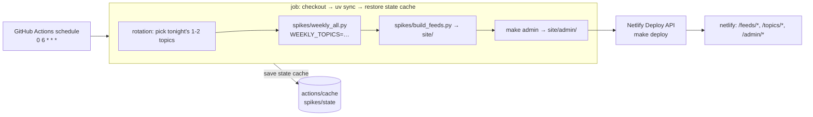

# Deployment Plan — Scheduled Job on GitHub Actions + Netlify Front End

Audience: the operator (you). Single topic: how the weekly selection system runs
unattended — the nightly job on GitHub Actions, the static front end on Netlify,
and the two-topics-per-night rotation. Cost/sufficiency verdict at the end.

Related: `docs/prd.md` FR-7 (publish), FR-8 (recurring run), FR-9 (weekly
selection). The run pipeline itself is `spikes/weekly_all.py` + `spikes/build_feeds.py`
+ `spikes/deploy_site.py` (see AGENTS.md).

## Architecture



State stays out of git: `spikes/state/` (feeds/verdicts/picks JSONL + stories) is
the idempotency memory — feed TTL, verdict cache, pick exclusion. It is restored
into the ephemeral runner at job start and saved back at job end.

## Nightly rotation (two topics per night)

13 topics, 2 per night × 7 nights = 14 slots → 6 nights of 2, 1 night of 1.

Required change (not yet implemented): `spikes/weekly_all.py` accepts
`WEEKLY_TOPICS` env (comma-separated topic names) and `plan_runs` filters to
that subset — freshness gating still applies, so a topic in tonight's slot that
ran < 7 days ago is skipped (cheap night, correct).

Required new script: `spikes/topic_rotation.py` — deterministic from the date:

- Sort topic names; index `t = (topic_idx + week_offset) % 13`, chunk the
  sorted list into 7 groups of 2 (last group of 1), assign group `d` to
  weekday `d`, `week_offset = iso_week % 7` shuffles pairings weekly.
- Output: tonight's topic names, one per line (`--csv` for the workflow).
- Property that makes the rotation the recovery path: a missed or wiped run
  leaves topics stale, and the rotation re-covers every topic within ~a week
  automatically. A full cache eviction never needs a manual mega-run.

Acceptance: `python spikes/topic_rotation.py` on any date prints 2 (or 1)
distinct topic names; across any 7 consecutive days every topic appears ≥ 1×.

## State persistence (actions/cache)

Why cache, not git: state is personal data + high churn; the repo rule is
"never commit personal data" (`AGENTS.md`), and `spikes/state/` is gitignored.
Why cache, not object storage: the state is ~1–2 MB now (grows slowly;
PRD FR-9 cache compaction is the engine-stage fix); actions/cache is free and
needs no credentials.

| Risk | Effect | Recovery |
|---|---|---|
| Cache evicted (7 days unused) or key miss | Run starts from empty state | Rotation re-covers all topics over the next week at 2/night; no manual step |
| Job fails mid-run | Partial state saved (append-only JSONL + atomic per-topic writes are crash-safe) | Next night's run continues idempotently |
| Overlapping runs | Cache save/restore races | `concurrency: group: weekly` prevents overlap |

Cache spec: restore `actions/cache@v4` with `restore-keys: weekly-state-`;
save `actions/cache/save@v4` with `key: weekly-state-${{ github.run_id }}`,
`if: always()`.

## Workflow (reference)

`.github/workflows/weekly.yml` — schedule `0 6 * * *` (matches
`RECURRING_CRON` default) + `workflow_dispatch` for manual runs:

```yaml
name: weekly
on:
  schedule: [{ cron: "0 6 * * *" }]
  workflow_dispatch: {}
concurrency: { group: weekly, cancel-in-progress: false }
jobs:
  run:
    runs-on: ubuntu-latest
    steps:
      - uses: actions/checkout@v4
      - uses: astral-sh/setup-uv@v5
      - run: uv sync --frozen
      - uses: actions/cache@v4
        with: { path: spikes/state, restore-keys: weekly-state- }
      - run: echo "$FEEDLY_OPML_B64" | base64 -d > feedly.opml   # exclusion set
        env: { FEEDLY_OPML_B64: ${{ secrets.FEEDLY_OPML_B64 }} }
      - run: echo "topics=$(.venv/bin/python spikes/topic_rotation.py --csv)" >> "$GITHUB_OUTPUT"
        id: rotation
      - run: TOPICS="${{ steps.rotation.outputs.topics }}" uv run python spikes/weekly_all.py
        env: { OPENCODE_GO_API_KEY: ..., OPENCODE_GO_BASE_URL: ..., EXA_API_KEY: ... }
      - run: uv run python spikes/build_feeds.py
      - run: uv run python spikes/deploy_site.py
        env: { DEPLOY_TOKEN: ${{ secrets.DEPLOY_TOKEN }}, NETLIFY_SITE_ID: ${{ secrets.NETLIFY_SITE_ID }} }
      - uses: actions/cache/save@v4
        if: always()
        with: { path: spikes/state, key: weekly-state-${{ github.run_id }} }
```

Secrets (GitHub repo secrets, private repo): `OPENCODE_GO_API_KEY`,
`OPENCODE_GO_BASE_URL`, `EXA_API_KEY`, `FEEDLY_OPML_B64` (base64 of
`feedly.opml` — only read when a source list regenerates, but required for the
runner's generate path), `DEPLOY_TOKEN`, `NETLIFY_SITE_ID`.

## Front end (Netlify)

Layout served from `spikes/output/site/` (already the `make feeds` output):
`/feeds/{slug}.xml` (Feedly polls), `/topics/{slug}/` (long reads),
`/admin/` (status + failures).

- Deploy: existing `make deploy` (Netlify Deploy API, atomic per-deploy).
  Free tier: 100 GB bandwidth/mo — ample.
- Admin privacy: Netlify free has no auth. v1 = obfuscated URL
  (`/admin/<random-token>/`, `SITE_BASE_URL` carries the token); upgrade =
  basic-auth edge function (Netlify Functions, ~20 lines) if you want real
  auth. Never deploy admin to a guessable path.

Required change (not yet implemented): the runner writes machine-readable run
records (`spikes/state/runs/{ts}.json` + `latest.json`: per-topic status,
picks, verdict counts, story version, list status, failure + traceback excerpt)
and `make admin` renders `site/admin/` from them — same pure-rendering pattern
as `make feeds`. "Why it's failing" = the failure page rendered from those
records + the per-topic tracebacks the runner already logs.

## Failure modes

| Failure | Effect | Recovery |
|---|---|---|
| LLM/Exa/router error on one topic | Topic fails, batch continues (isolated, traceback logged) | Auto-retried once in-run; re-queued next rotation |
| GitHub outage / missed schedule | No run that night | Rotation self-heals within the week |
| Netlify outage | Feeds 404, Feedly poll fails | Next deploy restores |
| Source-list generation non-JSON prose | Topic fails (bounded retry already in runner) | Stronger nudge + retry landed 2026-08-03; next rotation re-attempts |

## Cost

| Item | Plan | Cost |
|---|---|---|
| GitHub Actions | free, 2000 min/mo private repos; nightly job ≈ 60–120 min/mo | $0 |
| actions/cache | 10 GB limit, evicted after 7 days unused (daily access keeps it) | $0 |
| Netlify | free: 100 GB bandwidth, atomic deploys | $0 |
| LLM + Exa | unchanged — the router key's existing spend; 2 topics/night is a small slice | existing budget |
| State backup | none needed (state is regenerable; worst case = one re-covery week) | $0 |

## Sufficiency verdict

Yes — this is sufficient for a single-user personal system. Free tiers cover
the whole loop, the two failure classes (cache eviction, missed schedule) are
benign and self-healing by the rotation design, and the only real ongoing cost
is LLM/Exa usage, which the 2-topics-per-night cadence deliberately spreads.
You outgrow it when you need: guaranteed uptime (then add the VPS from the
earlier discussion), >1 admin user with real auth (edge function or VPS), or
state > ~1 GB (then move cache → R2).

## Implementation order

1. `spikes/weekly_all.py`: `WEEKLY_TOPICS` filter in `plan_runs` (test-first).
2. `spikes/topic_rotation.py` + date-rotation test.
3. Runner run records (`spikes/state/runs/`) + `make admin` rendering.
4. `.github/workflows/weekly.yml` + secrets + feedly.opml secret.
5. Verify: `workflow_dispatch` run → admin page shows the night's 2 topics,
   feed XML updates on Netlify, second consecutive night is cheap (cached).
