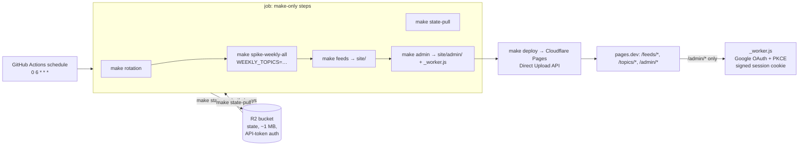

# Deployment Plan — Scheduled Job on GitHub Actions + Cloudflare Free Stack

Audience: the operator (you). Single topic: how the weekly selection system runs
unattended — the nightly job on GitHub Actions, the static front end (feeds,
topic pages, admin) on Cloudflare Pages, the two-topics-per-night rotation, and
authenticated state persistence in Cloudflare R2. Cost/sufficiency verdict at
the end.

Why Cloudflare instead of Netlify: on Netlify's 2025 credit-based pricing,
production deploys cost ~15 credits each against a 300-credit/month free cap —
a nightly deploy cadence (≈450 credits/mo) exceeds the free plan. Cloudflare
Pages has 500 free builds/mo with no per-deploy charge, R2 has auth + storage
with no custom service code, and the admin auth is a free Pages Function (no
domain needed). Netlify was fully removed in the cutover (`signalflow/deploy.py`
is the Cloudflare Pages Direct Upload adapter; there is no second host).

Related: `docs/prd.md` FR-7 (publish), FR-8 (recurring run), FR-9 (weekly
selection). Run pipeline: `make rotation` → `make state-pull` →
`make spike-weekly-all` → `make feeds` → `make admin` → `make deploy` →
`make state-push`.

## Architecture

State stays out of git: `spikes/state/` (feeds/verdicts/picks JSONL + stories +
per-topic picks + run records) is the idempotency memory — feed TTL, verdict
cache, pick exclusion. It lives in R2 and is pulled into the ephemeral runner at
job start, pushed back at job end.

## State persistence + PUT-side auth (R2)

R2 is the store **and** the auth: the job holds a scoped API token (GH secret)
and talks to the S3-compatible API through `rclone`, invoked by
`make state-pull` / `make state-push` (`spikes/state_sync.py` — a thin wrapper
that builds the rclone env + data-file filters; rclone itself stays an ops
binary, never repo logic).

| | |
|---|---|
| Bucket | one, e.g. `signalflow-state` (free tier: 10 GB, zero egress, ~1M writes/mo — state is ~1 MB) |
| Auth | R2 API token (access key + secret) restricted to that bucket, stored as GH secrets — real credentials, not obfuscation |
| Pull | `make state-pull` — `rclone sync r2:signalflow-state spikes/state` with `--filter` (only the data files: `weekly_feeds.jsonl`, `weekly_verdicts.jsonl`, `weekly_picks.jsonl`, `stories/`, `picks/`, `runs/` — never logs or pids) |
| Push | same command reversed (`make state-push`), `if: always()` — partial state beats none; runs are idempotent |
| Single writer | only the GitHub job (workflow `concurrency` group prevents overlap); never run local and scheduled simultaneously |

## Nightly rotation (two topics per night)

13 topics, 2 per night × 7 nights = 14 slots → Mon-Sat run 2, Sunday runs 1.
**Fixed weekly schedule** (no week-offset): sorted topic names are chunked
Mon-Sat into pairs and Sunday takes the final single topic. Each topic has a
fixed weekday slot — this is what guarantees ANY 7 consecutive days cover every
topic at least once, which is the property that makes the rotation the
self-healing recovery path. (A week-offset rotation would shuffle pairings but
break that guarantee for windows spanning a week boundary — rejected.)

Implemented: `spikes/topic_rotation.py` — `rotation_for(day, topics)` is pure
and deterministic; `make rotation` prints tonight's topics as CSV (the
workflow captures it into `WEEKLY_TOPICS`).

`make spike-weekly-all` accepts `WEEKLY_TOPICS` env (comma-separated topic
names) and `plan_runs` filters to that subset — freshness gating still
applies, so a topic in tonight's slot that ran < 7 days ago is skipped (cheap
night, correct).

Acceptance (tests): `make rotation` on any date prints 2 (or 1) distinct topic
names; across any 7 consecutive days every topic appears ≥ 1×.

## Front end + admin (Cloudflare Pages)

Layout served from `spikes/output/site/`: `/feeds/{slug}.xml` (Feedly polls),
`/topics/{slug}/` (long reads), `/admin/` (status + failures).

- **Run records** (`spikes/state/runs/{ts}.json` + `latest.json`): the runner
  writes machine-readable per-topic status after every night — ok/failed,
  picks, story version, verdict count, source-list status, error + redacted
  traceback excerpt, the night's rotation subset, and the fresh skips.
- **`make admin`** renders `site/admin/` from those records
  (`signalflow/admin.py`, pure rendering, every value HTML-escaped) and copies
  the gate worker into `site/_worker.js`.
- **Admin auth — Google OAuth in a Pages Function** (`spikes/pages_worker.js`):
  the advanced-mode `_worker.js` guards `/admin/*` with Google sign-in
  (authorization code + PKCE, stateless HMAC-signed session cookie, email
  allowlist from `ADMIN_EMAILS`); everything else is served statically via
  `env.ASSETS`. Works on the free `*.pages.dev` subdomain — no custom domain.
  It is the one JS artifact in the stack (deployment concern, not engine code;
  plain ESM, no bundling step). Secrets live as Pages project secrets, not GH
  secrets.
- **Deploy:** `make deploy` (depends on `make feeds` + `make admin`) → Cloudflare
  Pages Direct Upload API (`signalflow/deploy.py`): upload-token → check-missing
  → upload → upsert-hashes → create deployment. Asset hashes are
  blake3(base64+ext)[:32], matching wrangler, so unchanged nights upload
  nothing. **Guard:** if `site/admin/` exists without `_worker.js`, the deploy
  refuses — the admin would be served unprotected.

## Workflow

`.github/workflows/weekly.yml` — schedule `0 6 * * *` (matches
`RECURRING_CRON` default) + `workflow_dispatch` for manual runs. **CI runs only
make targets** (house rule: the Makefile is the single dev entry point); the
only non-make steps are tool bootstrap (a pinned rclone binary for the state
sync) and the `GITHUB_OUTPUT` capture of `make rotation`'s CSV. Steps:

checkout → install rclone → `make setup` → `make feedly-opml` (decodes the
`FEEDLY_OPML_B64` secret) → `make state-pull` → `make rotation` (captured into
`WEEKLY_TOPICS`) → `make spike-weekly-all` (LLM/Exa/Google keys as env) →
`make feeds` → `make admin` → `make deploy` (CF creds as env) →
`make state-push` (`if: always()`).

GH secrets (private repo): `OPENCODE_GO_API_KEY`, `OPENCODE_GO_BASE_URL`,
`GOOGLE_API_KEY`, `EXA_API_KEY`, `FEEDLY_OPML_B64` (base64 of `feedly.opml`),
`R2_ACCESS_KEY_ID` + `R2_SECRET_ACCESS_KEY` + `R2_ENDPOINT` + `R2_BUCKET`,
`CF_API_TOKEN` + `CF_ACCOUNT_ID` + `CF_PROJECT`. Repo variable:
`SITE_BASE_URL` (the `*.pages.dev` URL once the project exists — deploy
refuses while it is the placeholder).

Pages project secrets (set in the dashboard/wrangler, never in GH):
`GOOGLE_CLIENT_ID`, `GOOGLE_CLIENT_SECRET`, `SESSION_SECRET`, `ADMIN_EMAILS`.

## Provisioning checklist (account side — you do this, once)

1. **Cloudflare account** — create at dash.cloudflare.com (free plan).
2. **API token** — My Profile → API Tokens → Create: `Account` → `Cloudflare
   Pages: Edit` + `Workers R2 Storage: Edit`, scoped to your account (two
   permissions on one token is fine). Save the token value.
3. **R2 bucket** — R2 → Create bucket: `signalflow-state` (private). Under
   R2 → Manage R2 API Tokens, create an access key (Access Key ID + Secret)
   for that bucket. Note your **account id** (dashboard home, right column);
   `R2_ENDPOINT = https://<account-id>.r2.cloudflarestorage.com`.
4. **Pages project** — Workers & Pages → Create → Pages → Upload assets
   (Direct Upload): name it `signalflow` (must equal `CF_PROJECT`). An empty
   first upload is fine.
5. **Google OAuth client** — Google Cloud Console → Credentials → Create
   OAuth client ID (Web application). Authorized redirect URI:
   `https://signalflow.pages.dev/admin/auth/callback`. Copy the client ID +
   secret.
6. **Pages secrets** — Pages project → Settings → Environment variables →
   Add (encrypted): `GOOGLE_CLIENT_ID`, `GOOGLE_CLIENT_SECRET`, `SESSION_SECRET`
   (any long random string), `ADMIN_EMAILS` (comma-separated; the email of your
   Google account).
7. **GH repo secrets** — Settings → Secrets and variables → Actions: add the
   secret list above; add `SITE_BASE_URL` as a **variable** =
   `https://signalflow.pages.dev`.
8. **First run** — `workflow_dispatch` on the `weekly` workflow. Check: state
   pull/push round-trips, the admin page shows the night's 2 topics, feed XMLs
   update, and a second consecutive night is cheap (verdict/feed caches,
   check-missing upload skip). Subscribe `https://signalflow.pages.dev/feeds/<slug>.xml`
   in Feedly.

## Failure modes

| Failure | Effect | Recovery |
|---|---|---|
| LLM/Exa/router error on one topic | Topic fails, batch continues (isolated, traceback in the run record) | Auto-retried once in-run; re-queued next rotation |
| GitHub outage / missed schedule | No run that night | Rotation self-heals within the week |
| R2 unavailable at pull | Run starts from empty state | Rotation re-covers all topics over the next week |
| R2 unavailable at push | State stale by one night | Next push overwrites; runs are idempotent |
| Pages/CDN outage | Feeds 404, Feedly poll fails | Next deploy restores |
| Worker misconfigured (missing Pages secret) | `/admin/*` returns 500; feeds unaffected | Fix the Pages secret, redeploy |
| Deploy with admin but no worker | Refused before any HTTP call | Run `make admin` and redeploy |
| Token leak | Anyone with the token can read/write state | Rotate the R2 token (bucket-scoped, single credential) |

## Cost

| Item | Plan | Cost |
|---|---|---|
| GitHub Actions | free, 2000 min/mo private repos; nightly job ≈ 60–120 min/mo | $0 |
| Cloudflare Pages | 500 builds/mo, no per-deploy charge, free bandwidth for this scale; Pages Functions on the free plan | $0 |
| Cloudflare R2 | 10 GB, zero egress, ~1M writes/mo; state ≈ 1 MB | $0 |
| Google OAuth client | any Google account can create OAuth clients | $0 |
| LLM + Exa | unchanged — the router key's existing spend; 2 topics/night is a small slice | existing budget |

## Sufficiency verdict

Yes — sufficient and fully free for a single-user personal system. Auth is real
where it must be (R2 API token on the write side; Google OAuth on the admin)
and nothing depends on a custom service you would have to operate. The
tradeoffs to accept: a second vendor (Cloudflare) on top of GitHub; the state
store is object storage rather than an HTTP API (irrelevant to the admin,
which is rendered statically); the admin auth is ~150 lines of worker code
instead of a dashboard toggle (the price of not owning a domain — Cloudflare
Access, which would be zero code, requires a custom domain). You outgrow this
when you need guaranteed uptime, more than a handful of admin users, or state
beyond the free quotas (years away at current growth — and FR-9 cache
compaction is the yearly maintenance that keeps it small).

## Implementation order

1. ✅ `spikes/weekly_all.py`: `WEEKLY_TOPICS` filter in `plan_runs` (test-first).
2. ✅ `spikes/topic_rotation.py` + date-rotation test (fixed per-weekday schedule).
3. ✅ Runner run records (`spikes/state/runs/`) + `make admin` rendering
   (`signalflow/admin.py`).
4. ✅ `signalflow/deploy.py`: Cloudflare Pages Direct Upload adapter
   (test-first, fake http) — replaces the Netlify adapter (fully removed;
   `PUBLISH_TARGET`/`DEPLOY_TOKEN`/`NETLIFY_SITE_ID` gone from Config).
5. ✅ Admin auth: Google OAuth `_worker.js` Pages Function + deploy guard.
6. ✅ Make targets (`rotation`, `state-pull`, `state-push`, `feedly-opml`,
   `admin`, `deploy`) + `.github/workflows/weekly.yml`
   (make-only) + `.env.example` + PRD/AGENTS updates.
7. ⏳ Provisioning: Cloudflare account/bucket/project/token, Google OAuth
   client, Pages secrets, GH secrets (see checklist above) — blocked on you.
8. ⏳ Verify: `workflow_dispatch` run → rclone pull/push round-trips state,
   admin page shows the night's 2 topics, feed XML updates, second consecutive
   night is cheap (cached + check-missing upload skip).
