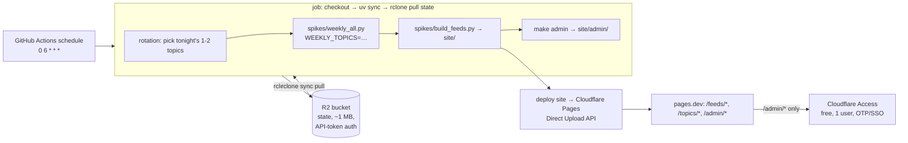

# Deployment Plan — Scheduled Job on GitHub Actions + Cloudflare Free Stack

Audience: the operator (you). Single topic: how the weekly selection system runs
unattended — the nightly job on GitHub Actions, the static front end (feeds,
topic pages, admin) on Cloudflare Pages, the two-topics-per-night rotation, and
authenticated state persistence in Cloudflare R2. Cost/sufficiency verdict at
the end.

Why Cloudflare instead of Netlify: on Netlify's 2025 credit-based pricing,
production deploys cost ~15 credits each against a 300-credit/month free cap —
a nightly deploy cadence (≈450 credits/mo) exceeds the free plan. Cloudflare
Pages has 500 free builds/mo with no per-deploy charge, R2 has auth + storage
with no custom service code, and Cloudflare Access gives free real auth for the
admin. Netlify remains viable only on a pre-2025 legacy free account (unlimited
deploys); if that is the account's vintage, the Netlify variant in the
"Alternatives" section applies.

Related: `docs/prd.md` FR-7 (publish), FR-8 (recurring run), FR-9 (weekly
selection). Run pipeline: `spikes/weekly_all.py` + `spikes/build_feeds.py` +
`spikes/deploy_site.py` (see AGENTS.md).

## Architecture



State stays out of git: `spikes/state/` (feeds/verdicts/picks JSONL + stories +
per-topic picks + run records) is the idempotency memory — feed TTL, verdict
cache, pick exclusion. It lives in R2 and is pulled into the ephemeral runner at
job start, pushed back at job end.

## State persistence + PUT-side auth (R2)

R2 is the store **and** the auth: the job holds a scoped API token (GH secret)
and talks to the S3-compatible API through `rclone` (an ops binary in the
workflow — not repo code). No custom web service, nothing to maintain.

| | |
|---|---|
| Bucket | one, e.g. `signalflow-state` (free tier: 10 GB, zero egress, ~1M writes/mo — state is ~1 MB) |
| Auth | R2 API token (access key + secret) restricted to that bucket, stored as GH secrets — real credentials, not obfuscation |
| Pull | `rclone sync r2:signalflow-state spikes/state --filter` (only the data files: `weekly_feeds.jsonl`, `weekly_verdicts.jsonl`, `weekly_picks.jsonl`, `stories/`, `picks/`, `runs/` — never logs or pids) |
| Push | same command reversed, `if: always()` — partial state beats none; runs are idempotent |
| Single writer | only the GitHub job (workflow `concurrency` group prevents overlap); never run local and scheduled simultaneously |

If you want the literal "little web service" instead of object-store semantics:
a ~40-line Cloudflare **Worker + KV** (free: 100k requests/day, 1 GB KV) with
`GET /.state/{key}` public and `PUT` gated by a bearer-token header checked in
the Worker. Same auth story, an HTTP API you own, marginally more code.

## Nightly rotation (two topics per night)

13 topics, 2 per night × 7 nights = 14 slots → Mon-Sat run 2, Sunday runs 1.
**Fixed weekly schedule** (no week-offset): sorted topic names are chunked
Mon-Sat into pairs and Sunday takes the final single topic. Each topic has a
fixed weekday slot — this is what guarantees ANY 7 consecutive days cover every
topic at least once, which is the property that makes the rotation the
self-healing recovery path. (A week-offset rotation would shuffle pairings but
break that guarantee for windows spanning a week boundary — rejected.)

Implemented: `spikes/topic_rotation.py` — `rotation_for(day, topics)` is pure
and deterministic; the CLI prints tonight's topics (`--date` for testing,
`--csv` for the workflow).

Required change (implemented): `spikes/weekly_all.py` accepts `WEEKLY_TOPICS`
env (comma-separated topic names) and `plan_runs` filters to that subset —
freshness gating still applies, so a topic in tonight's slot that ran < 7 days
ago is skipped (cheap night, correct).

Acceptance (tests): `python spikes/topic_rotation.py` on any date prints 2 (or
1) distinct topic names; across any 7 consecutive days every topic appears ≥ 1×.

## Front end + admin (Cloudflare Pages)

Layout served from `spikes/output/site/`: `/feeds/{slug}.xml` (Feedly polls),
`/topics/{slug}/` (long reads), `/admin/` (status + failures).

- Deploy: adapt `signalflow/deploy.py` to the Cloudflare Pages Direct Upload
  API (same shape as the current Netlify upload: one authenticated POST of the
  site zip; free, no per-deploy credits, atomic per deploy).
- Admin auth (nice-to-have, free): **Cloudflare Access** (Zero Trust free plan,
  50 users) with an Access policy on `/admin/*` — real login (email OTP or
  Google SSO), zero code. Requires the site hostname on a Cloudflare-managed
  domain. Without a custom domain: a ~30-line basic-auth **Pages Function**
  (browser-native prompt, works on the free `*.pages.dev` subdomain).

Required change (not yet implemented): the runner writes machine-readable run
records (`spikes/state/runs/{ts}.json` + `latest.json`: per-topic status,
picks, verdict counts, story version, list status, failure + traceback excerpt)
and `make admin` renders `site/admin/` from them — same pure-rendering pattern
as `make feeds`. "Why it's failing" = the failure page rendered from those
records + the per-topic tracebacks the runner already logs.

## Workflow (reference)

`.github/workflows/weekly.yml` — schedule `0 6 * * *` (matches
`RECURRING_CRON` default) + `workflow_dispatch` for manual runs:

```yaml
name: weekly
on:
  schedule: [{ cron: "0 6 * * *" }]
  workflow_dispatch: {}
concurrency: { group: weekly, cancel-in-progress: false }
jobs:
  run:
    runs-on: ubuntu-latest
    steps:
      - uses: actions/checkout@v4
      - uses: astral-sh/setup-uv@v5
      - run: uv sync --frozen
      - run: echo "$FEEDLY_OPML_B64" | base64 -d > feedly.opml   # exclusion set
        env: { FEEDLY_OPML_B64: ${{ secrets.FEEDLY_OPML_B64 }} }
      - run: rclone sync r2:signalflow-state spikes/state --filter "..."   # pull
        env: { RCLONE_CONFIG_R2_TYPE: s3, RCLONE_CONFIG_R2_ACCESS_KEY_ID: ${{ secrets.R2_ACCESS_KEY_ID }}, ... }
      - run: echo "topics=$(.venv/bin/python spikes/topic_rotation.py --csv)" >> "$GITHUB_OUTPUT"
        id: rotation
      - run: TOPICS="${{ steps.rotation.outputs.topics }}" uv run python spikes/weekly_all.py
        env: { OPENCODE_GO_API_KEY: ..., OPENCODE_GO_BASE_URL: ..., EXA_API_KEY: ... }
      - run: uv run python spikes/build_feeds.py
      - run: uv run python spikes/deploy_site.py
        env: { CF_API_TOKEN: ${{ secrets.CF_API_TOKEN }}, CF_ACCOUNT_ID: ..., CF_PROJECT: ... }
      - run: rclone sync spikes/state r2:signalflow-state --filter "..."   # push
        if: always()
        env: { ... }
```

Secrets (GH repo secrets, private repo): `OPENCODE_GO_API_KEY`,
`OPENCODE_GO_BASE_URL`, `EXA_API_KEY`, `FEEDLY_OPML_B64` (base64 of
`feedly.opml` — only read when a source list regenerates, but required for the
runner's generate path), `R2_ACCESS_KEY_ID` + `R2_SECRET_ACCESS_KEY`,
`CF_API_TOKEN` + `CF_ACCOUNT_ID` + `CF_PROJECT` (deploy), Cloudflare Access
needs no secrets (the user logs in).

## Failure modes

| Failure | Effect | Recovery |
|---|---|---|
| LLM/Exa/router error on one topic | Topic fails, batch continues (isolated, traceback logged) | Auto-retried once in-run; re-queued next rotation |
| GitHub outage / missed schedule | No run that night | Rotation self-heals within the week |
| R2 unavailable at pull | Run starts from empty state | Rotation re-covers all topics over the next week |
| R2 unavailable at push | State stale by one night | Next push overwrites; runs are idempotent |
| Pages/CDN outage | Feeds 404, Feedly poll fails | Next deploy restores |
| Token leak | Anyone with the token can read/write state | Rotate the R2 token (bucket-scoped, single credential) |

## Cost

| Item | Plan | Cost |
|---|---|---|
| GitHub Actions | free, 2000 min/mo private repos; nightly job ≈ 60–120 min/mo | $0 |
| Cloudflare Pages | 500 builds/mo, no per-deploy charge, free bandwidth for this scale | $0 |
| Cloudflare R2 | 10 GB, zero egress, ~1M writes/mo; state ≈ 1 MB | $0 |
| Cloudflare Access | Zero Trust free plan, 50 users | $0 |
| LLM + Exa | unchanged — the router key's existing spend; 2 topics/night is a small slice | existing budget |
| (optional) custom domain for Access | ~$10/yr if you don't already own one | $0–10/yr |

## Sufficiency verdict

Yes — sufficient and fully free for a single-user personal system. Auth is real
where it must be (R2 API token on the write side; Cloudflare Access or a
basic-auth function on the admin) and nothing depends on a custom service you
would have to operate. The tradeoffs to accept: a second vendor (Cloudflare) on
top of GitHub; the state store is object storage rather than an HTTP API
(irrelevant to the admin, which is rendered statically); a custom domain is the
prerequisite for the nicest admin auth (without one, the free basic-auth
function covers it). You outgrow this when you need guaranteed uptime, >50
admin users, or state beyond the free quotas (years away at current growth —
and FR-9 cache compaction is the yearly maintenance that keeps it small).

## Implementation order

1. ✅ `spikes/weekly_all.py`: `WEEKLY_TOPICS` filter in `plan_runs` (test-first) — done.
2. ✅ `spikes/topic_rotation.py` + date-rotation test — done (fixed per-weekday schedule, see Nightly rotation).
3. ⏳ Runner run records (`spikes/state/runs/`) + `make admin` rendering.
4. ⏳ `signalflow/deploy.py`: Cloudflare Pages Direct Upload adapter (test-first,
   fake http) — replaces the Netlify adapter.
5. ⏳ R2 bucket + rclone filters in the workflow; CF Pages project + Access
   policy (or basic-auth Pages Function).
6. ⏳ `.github/workflows/weekly.yml` + secrets + feedly.opml secret.
7. ⏳ Verify: `workflow_dispatch` run → rclone pull/push round-trips state, admin
   page shows the night's 2 topics, feed XML updates, second consecutive night
   is cheap (cached).

## Alternatives (keep-Netlify variant)

If your Netlify account is pre-2025 legacy free (unlimited deploys, 125k
function invocations/mo), the Netlify variant from plan v2 still applies and is
equivalent in cost: site + admin on Netlify, state in a Netlify Function +
Blobs KV with a bearer-token check on PUT, admin behind a basic-auth Edge
Function. Same rotation and workflow; only the deploy/state/auth endpoints
differ. The Cloudflare stack above is preferred because it does not depend on
account vintage.
