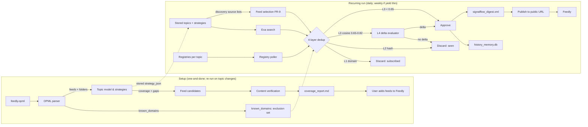

# SignalFlow — Product Requirements Document

**Status:** Draft v0.5 · **Audience:** engineers implementing v1 + product owner · **Source:** SignalFlow Architecture Proposal (2025)

Rev 5 changes: embeddings moved to Google `gemini-embedding-2` (router verified to have NO embeddings endpoint); env/config renamed to `OPENCODE_GO_*` + `GOOGLE_API_KEY`; spike proven end-to-end against the real OPML.
Rev 6 changes: FR-1/FR-2 (OPML → topic model → strategies) reframed as ONE-AND-DONE setup, re-run only when the user adds/removes a topic; FR-8 reframed as a single recurring run (default daily, weekly if daily yield is thin) that executes the STORED strategies (FR-3 discovery + FR-9 feed selection) and never re-derives them. `DAILY_CRON`/`WEEKLY_CRON` merged into `RECURRING_CRON`.

## Purpose

SignalFlow is a personal information fiduciary and outside-discovery engine. It ingests the user's existing subscription list (Feedly OPML) as an exclusion set, analyzes those subscriptions into a working topic model, and for every topic carefully builds a tailored discovery strategy. It then crawls sources the user does *not* read plus official program registries, filters for novel empirical events and first-principles commentary, de-duplicates against local semantic memory, and emits a private RSS digest that Feedly consumes.

This doc answers one question: **what must v1 build, and how do we know it works?**

## Problem

- The ad-supported media marketplace monetizes attention; feeds flood with non-actionable, distant negative news ("phantom risks").
- Existing readers only re-surface content from subscriptions the user already has.
- Program milestones (grant stage-gates, trial status shifts) reach traditional media late or never.
- The user's subscription list grows opportunistically; nobody audits it for topics that are under-covered or absent, and generic discovery approaches miss topic-specific sources.

## Goals (v1)

1. Surface novel empirical events and structural commentary **only from outside** the user's existing subscriptions.
2. Track program milestones directly from official registries, ahead of media coverage.
3. Never re-surface the same underlying event across outlets; penalize incremental-update noise.
4. Emit a private, skimmable RSS digest: observed event + core thesis, with outbound links, **subscribable in Feedly**.
5. Local-first: all state on the user's machine; the only outbound calls are the search, registry, and LLM APIs.
6. Build and maintain a per-user topic model from the Feedly OPML — with a careful, individually crafted discovery strategy for **each** topic (queries, domains, source types, relevant registries), reviewed against actual results.

## Non-Goals (v1)

- Podcast transcript ingestion and newsletter/Ghost directory crawling (deferred — see Future Work).
- Keyword-only matching (rejected by design; LLM-derived topic analysis and vector expansion replace it).
- Political horse-race, speculative hype, or rage-bait coverage (explicitly filtered out).
- No web UI, no email, no feed platform. The digest is a static file published to a public URL for Feedly to poll.

## Key Terms

| Term | Meaning |
|---|---|
| OPML | Feedly export (`feedly.opml`); the user's full subscription list |
| `known_domains` | Domains extracted from OPML; the exclusion blacklist |
| Topic | A field of inquiry in the user's model (e.g. "Grid Decarbonization"). Set is derived, never hardcoded |
| Discovery strategy | The per-topic plan: query formulations, domain patterns, source types, relevant registries — crafted per topic, revised against yield |
| Empirical event | One sentence: the observed data shift / enactment / stage-gate transition |
| Core thesis | One sentence: the author's structural argument |
| Delta evaluator | LLM pass deciding whether 0.65–0.82-similar content carries new information |
| Embedding | Number-list encoding of a text's meaning; cosine similarity between two embeddings ≈ "same story?" |
| Coverage gap | A topic with fewer than `MIN_FEEDS_PER_TOPIC` subscribed feeds mapping to it |
| Promotion loop | Adding a recommended feed to Feedly makes it a `known_domain`; the engine then excludes it — by design |

## External Services (plain language)

| Service | What it is | Why SignalFlow needs it |
|---|---|---|
| Exa | AI-native search API: returns web results with content, supports neural + keyword search | finds candidate articles and feeds from sources you don't subscribe to; also powers feed-candidate gathering for coverage |
| Opencode go router (one key) | OpenAI-compatible gateway (`https://opencode.ai/zen/go/v1`) serving chat models incl. DeepSeek v4 Flash | topic model & strategies, candidate evaluation, delta check, feed verification. **No embeddings endpoint** (verified: `/models` lists 24 chat models only; `/embeddings` 404s) |
| Google Generative Language API (one key) | `gemini-embedding-001` embeddings (3072-dim) — GA model with its own free-tier quota bucket (100 RPM / 1K RPD) | "same story?" de-duplication numbers; calls batched at 25 and paced 20s |
| Registry APIs (UKRI, ClinicalTrials.gov, Ofgem SIF) | Official public data feeds for research grants and trials | program milestones reported directly, ahead of any media coverage |

All reasoning (DeepSeek v4 Flash) goes through the Opencode go router under one key; embeddings go through Google (the router has none). Exa and the registries have separate keys.

API keys live in the environment only — **never** in code, docs, or any committed file.

## Example Topic Frame (illustrative, NOT fixed)

The six topics below come from the proposal and show the *shape* a topic takes. v1 derives the actual topic set from the user's OPML (FR-2). **Nothing in this table is hardcoded into the engine.**

| # | Example topic | Example boundary |
|---|---|---|
| 1 | Energy & Power Systems | Generation, storage, transmission physics, power electronics, grid balance, Net Zero |
| 2 | Compute & AI Infrastructure | Physical limits of compute, data centers, silicon manufacturing, power constraints |
| 3 | Applied Life Sciences & Health | Novel therapeutic platforms, etiology of complex chronic illness, biotech scaling |
| 4 | Geopolitics & Military Strategy | Doctrine shifts, autonomous/unmanned systems, industrial base capacity, defense supply |
| 5 | Systems History & Comm Tech | Quantitative/logistical history, evolution of communication technology and information flows |
| 6 | Industrial Policy & Infrastructure | Physical construction costs, transport, agricultural productivity, regulatory inertia |

## Functional Requirements

Priorities: MUST (v1 blocks), SHOULD (expected v1), COULD (stretch).

### FR-1 OPML dual parser — MUST
- Parse `feedly.opml`; extract every `outline/xmlUrl` → domain → `known_domains` (strip `www.`).
- Extract folder names + feed titles per category → raw material for the topic model (FR-2).
- **Never run without OPML.** Missing or unparseable `feedly.opml` aborts the run with a clear error (fail-fast). The reference code's hardcoded fallback domain list is rejected: silently running with a 4-domain blacklist voids the zero-duplication guarantee.
- Acceptance: given a test OPML with N feeds, `known_domains` contains exactly the N distinct domains.

### FR-2 Topic model & coverage analysis — MUST (one-and-done setup, NOT in the recurring run)
Builds the working topic model and the per-topic discovery strategies. This is a SETUP step, run once (and re-run only when the user adds/removes a topic) — it is NOT part of the daily/weekly execution loop, which starts from the stored strategies:
1. **Topic elicitation:** embed a sample of each feed's recent items (Google `gemini-embedding-001`), cluster the **item** embeddings with spherical k-means (fixed seed; feed-mean clustering is signal-free — measured cross-feed mean sim 0.72 > intra-feed item sim 0.56), assign each feed to its plurality topic, then have the LLM name and refine each topic. Folder names are hints only — organizational buckets (e.g. "Stories") are never treated as topics, and URL-shaped names are skipped. The proposal's six topics are examples only, never a ceiling or a hardcoded list. **The curated final set (13 topics, walkthrough-approved) lives in `signalflow/topics.json`, human-readable in `docs/topics.md`** — that file is the source of truth the engine seeds from.
2. **Per-topic discovery strategy (the "take effort" step):** for **each** topic, an LLM crafts a deliberate strategy and stores it: multiple query formulations, high-density domain patterns, source-type mix (independent blogs, academic, newsletters, podcasts), relevant registries/APIs, and news-vs-analysis weighting. Generic one-size-fits-all queries are forbidden — each topic gets its own plan. **This stored strategy is what the recurring run executes** (FR-8); the feedly/OPML inputs are consumed here, once.
3. **Coverage map & gaps:** map subscribed feeds to topics; topic with < `MIN_FEEDS_PER_TOPIC` feeds → gap.
4. **Feed recommendations for gaps:** gather candidates (Exa, directories), then **verify by fetching each candidate's recent content and LLM-checking topical fit** — never recommend an uninspected feed. Each recommendation carries the verified sample link + one-line reason.
5. **Strategy revision:** strategies are not static. When a topic persistently yields nothing or the report shows a stale gap, the user re-runs this setup step (e.g. `make reseed`-style target) or asks the assistant to revise the topic — revision is an explicit, occasional action, not an automatic part of the recurring run.
- Acceptance: golden OPML with a deliberately thin topic → report flags the gap, shows a non-generic per-topic strategy for it, and recommends only feeds whose verified-sample links resolve. Re-running setup with one topic's yield artificially zeroed revises that topic's strategy (revision logged).

### FR-3 Discovery tiers — MUST (registries + search)
Execution uses each topic's strategy from FR-2 — never a fixed global query list.
**Tier A — Program registries (MUST):** poll structured JSON APIs for milestones, filtered to topics the strategy marks as registry-relevant:
- UKRI Gateway to Research (`https://gtr.ukri.org/api/projects`): new grants, status changes, outcome dataset registrations.
- ClinicalTrials.gov REST API: status shifts (e.g. RECRUITING → COMPLETED), result uploads.
- Ofgem SIF: projects moving through stage-gates (Discovery → Alpha → Beta → Deployment). **Gate:** a build-time spike must confirm a structured public API exists; if none, Ofgem is deferred (see Decisions).

**Tier B — Exa search crawling (MUST):** executes each topic's query formulations via Exa (`https://api.exa.ai`), including domain patterns like `site:substack.com`, `site:arxiv.org`, independent technical blogs. Query set comes from FR-2 strategies, not a spec table.

**Tier C — Podcast transcripts & directory feeds (COULD):** deferred (Future Work).

- Every candidate carries `{title, summary, url, source_tier, topic}`.
- Acceptance: a run with mocked API responses produces candidates per topic; each topic's queries come from its stored strategy; the strategy table is the single source of query truth.

### FR-4 Four-layer de-duplication — MUST
Pipeline order — cheapest first; **never** call the LLM before Layer 2:

| Layer | Check | Action |
|---|---|---|
| L1 Domain blacklist | domain ∈ `known_domains`? | DISCARD (subscribed) |
| L2 Exact hash | URL or title hash ∈ `seen_events`? | DISCARD (already seen) |
| L3 Vector cosine | embedding of empirical event vs `history_memory.db` | sim > 0.82 → DISCARD; 0.65–0.82 → L4; < 0.65 → APPROVE |
| L4 Delta evaluator | LLM: "new empirical data or structural shift beyond [date]?" | NO → DISCARD; YES → APPROVE & store |

- Embeddings via Google `gemini-embedding-001` (`EMBEDDING_MODEL`) — the GA embedding model on the existing Google key (the router has no embeddings endpoint, verified). **Never mix embedding models in the store** — switching requires re-embedding. (Done once: `gemini-embedding-2`'s per-model daily quota walled at ~50 requests; -001 has its own bucket, verified working.) Free-tier quotas are per model: 100 RPM / 30K TPM / 1,000 RPD; `batchEmbedContents` counts each sub-request toward RPM, so calls are paced at 20s with batch 25 (75 sub-reqs/min, under the cap), 429 → 30s backoff, persistent 429 → clean exit with checkpointed state. Thresholds are config; defaults 0.82 / 0.65 (the proposal's diagram value 0.85 is rejected as inconsistent with its own Section 3 spec).
- L2 is an explicit pre-filter. The reference code checks URL uniqueness only via DB `UNIQUE` after the LLM call — too late; move the check before any LLM spend.
- L4 must exist as a real second LLM pass (the reference code never wires it; 0.65–0.82 content is silently approved).
- Acceptance: three seeded articles about one underlying event (original, same-event different author, follow-up with a genuine new milestone) yield exactly one approval — the milestone one.

### FR-5 LLM evaluation — MUST
- Classify each candidate against the **derived topic set** (FR-2), not a fixed list; output strict JSON `{is_approved, topic, empirical_event, core_thesis}` (JSON mode).
- Approval rules: MUST describe a new empirical event, observed data shift, or first-principles systems analysis. MUST NOT be speculative hype, horse-race politics, or shallow reporting.
- Validate model output against the schema; malformed JSON → log + drop candidate (never crash the run).
- Acceptance: a golden set of 10 pre-labeled candidates (5 approve / 5 reject) classifies with no regressions.

### FR-6 Semantic memory (SQLite) — MUST
- `history_memory.db`, table `seen_events`: `id, url UNIQUE, title, event_summary, embedding_json, timestamp`.
- On approval: store event + embedding. Duplicate URL insert is a no-op (idempotent).
- Pruning: events older than 12 months are deleted by the daily maintenance step (FR-8). Dedup only matters for recent coverage windows; unbounded growth buys nothing.
- Acceptance: re-running the same day's pipeline emits no duplicate feed entries; a 13-month-old event is evicted.

### FR-7 RSS digest — MUST
- `signalflow_digest.xml`, RSS 2.0 via `feedgen`, atomically replaced each run. Feed id `https://signalflow.local/feed`, title "SignalFlow Discovery Digest".
- Entry: title prefixed `[Topic]`; body = `<b>Observed Event:</b>` + `<b>Systemic Thesis:</b>` + direct outbound link. Per-entry id = stable source URL (Feedly de-dupes on id).
- **Publish for Feedly:** the digest must be reachable at a public URL (Feedly polls URLs, not local files). Publish step uploads the file to the configured static host (default: Netlify) using a deploy token. Absolute URLs throughout.
- Acceptance: output parses with `feedparser`; each entry has both bullets and a working outbound URL; a fresh browser fetch of the public URL returns the current digest.

### FR-8 Recurring execution & maintenance — MUST
One recurring run (default daily; drop to weekly if daily surfaces too little new good content — see Decisions) executes the STORED strategies: load topics + strategies (seeded by FR-2 setup, NOT re-derived) → discover (FR-3) → feed-selection (FR-9) → dedup (FR-4) → evaluate (FR-5) → store (FR-6) → publish RSS (FR-7) → prune. The feedly/OPML/topic-model work (FR-1/FR-2) is NOT in this run — it happened at setup; the run starts from `signalflow/topics.json` + stored `strategy_json`.
- Idempotent: a re-run of the same day produces the same RSS (no duplicates).
- All failures logged; a failed run never publishes a partial or empty feed over a good one (atomic swap, keep previous digest).
- Acceptance: two consecutive runs with unchanged inputs produce identical digests; a coverage report is emitted by the run.

### FR-9 Weekly feed-based selection (spike-proven) — MUST
Crawl each topic's discovery source list (`docs/discovery/{slug}.json` → `crawl_root`) weekly and LLM-judge the week's items against the topic boundary, surfacing only genuinely interesting, relevant articles. Zero picks per source is a valid outcome. The mechanism is proven in `spikes/weekly_selection.py` and is slated to become an engine stage; the spike stays as the reference implementation until the stage lands.

Pipeline: load topic boundary + source list → fetch feeds (TTL'd cache, stale-fallback) → window to `RECENCY_DAYS` → exclude already-picked URLs → per-source LLM evaluation (hard OUT-scope gate, `MAX_PICKS_PER_SOURCE` cap, one retry for omitted verdicts) → defer folds into the per-topic area story → emit picks + report.

- **Area story** (`spikes/state/stories/{slug}.json`): long-form big-picture background (overview, per-subarea angles, open questions), seeded from the topic boundary + subareas ONLY (`prompts/generate_area_story.md`, no article input) and folded from approved picks in a way that adapts the big picture without appending article specifics. The story is injected as a per-subarea slice into evaluation prompts (no prompt grows with the story). Story quality is gated by `spikes/eval_story.py` (`make eval-story`): a reader with only generic-news exposure must be able to place a held-out article using the story alone.
- **Idempotency**: verdict cache keyed on (prompt revision, story version) — a prompt or story change re-keys and re-judges, exactly like FR-5 prompt bumps. Feed cache TTL + pick-history URL exclusion make same-week re-runs cheap; the system settles after one re-evaluation.
- **Global coverage**: topic boundary is geography-agnostic; evaluation prompt explicitly rejects OUT terms as scope-not-keywords (EV *policy* is IN, consumer EV *content* is OUT) and states there is no geographic restriction. Discovery queries are gated global by `spikes/eval_queries.py` (`make eval-queries`; regenerate via `make refresh-queries`).
- **Acceptance**: `make spike-weekly` on topic 01 emits picks with why-relevant notes and theses; `make eval-story` and `make eval-queries` pass; a re-run of the same week reuses the verdict cache (no re-evaluation).

**Wire-up contract** (decisions; the spike outputs become engine inputs):
- **Entry point**: weekly picks are trusted selection output. They do NOT re-enter the FR-4/FR-5 dedup+evaluate pipeline (that would double-judge and discard the story context). They DO pass the cheap mechanical dedup layers (L1 domain blacklist, L2 seen_events URL check) before entering the digest, so a story that also arrived via search cannot appear twice.
- **Persistence**: approved weekly picks ARE written to `seen_events` (FR-6) like any approved event — that is what makes the search→weekly duplicate guarantee hold in both directions (daily L2 blocks URLs already surfaced weekly). Storage: `url` = pick URL, `title` = pick title, `event_summary` = the `empirical_event` sentence, `topic` = the topic name, `embedding` = computed from the title+summary at write time (same embedder as FR-6). The weekly pick-history (`weekly_picks.jsonl`) remains the in-run exclusion set; `seen_events` is the cross-cadence source of truth.
- **Digest merge**: the weekly run renders ONLY its own picks into the digest (it does not rebuild from all `seen_events`, which would republish daily entries and break FR-8 idempotency). Both runs write `signalflow_digest.xml` atomically; the weekly publish replaces the daily digest with the weekly selection, so readers see the curated weekly set (decided: weekly wins the shared file). If both cadences must coexist in one feed, the digest entries are simply the union with per-entry id = source URL (Feedly de-dupes); default is weekly-wins.
- **Multi-topic iteration**: the weekly stage iterates every topic in `signalflow/topics.json` that has a `docs/discovery/{slug}.json`; topics without a discovery list are skipped and reported (they cannot be fed-selected until `make topic-sources` produces a list). Per-topic picks aggregate into one digest.
- **Contract adaptation**: the digest (FR-7) renders `analysis.empirical_event` + `analysis.core_thesis` from `ApprovedEvent`. Weekly picks carry `reason` + `thesis`; the engine stage maps pick → `Analysis`: `empirical_event` = the pick's `empirical_event` field (see below), `core_thesis` = pick `thesis`, `topic` = the topic name, `approved` = true. `Candidate`: `title` = pick title, `summary` = the `empirical_event` sentence, `url` = pick URL, `topic` = topic name, `source_tier` = `"weekly"` (a new tier value alongside `registry`/`search`; `models.py` must accept it). The pick `reason` (why-relevant note) is dropped from the digest body (it exists for curation transparency in the weekly report, not for readers); the digest keeps Observed Event + Systemic Thesis.
- **empirical_event schema**: the weekly evaluation verdict schema extends to `{"url", "approved", "reason", "thesis", "empirical_event"}`; `empirical_event` is REQUIRED for approved verdicts (empty/absent → verdict treated as malformed, retried once, then rejected), optional for rejected ones. It is the one-sentence description of the observed event, phrased for the digest bullet.
- **Query-store sync**: the engine's `discovery.py` reads queries from the topics table `strategy_json` (currently seeded empty), while `refresh-queries` writes `docs/discovery/*.json`. The engine stage must load queries from the discovery docs (or seed `strategy_json` from them) so the global query set actually runs.
- **Scheduling**: the recurring run (FR-8) executes BOTH FR-3 discovery tiers and the FR-9 feed-selection stage from the stored strategies — one cadence, default daily, configurable to weekly (`RECURRING_CRON`). There is no separate weekly engine run; the spike's "weekly" window (`RECENCY_DAYS`, default 7) applies to the feed-selection stage inside the recurring run. If daily runs surface too little new content, the whole run is set weekly (config-only, user decision).
- **Config**: `RECENCY_DAYS`, `MAX_PICKS_PER_SOURCE`, `MAX_ITEMS_PER_SOURCE`, eval thresholds move from spike constants into `signalflow/config.py` env surface.
- **Eval gates in the loop**: `make eval-story` / `make eval-queries` are manual pre-merge gates (LLM/network); they are not in CI, which stays deterministic.

## Non-Functional Requirements

| Concern | Requirement |
|---|---|
| Privacy | No telemetry. All state local. API keys in the environment only — **never** in code, docs, or any committed file |
| Cost | Per-run budget: max candidates per topic, max LLM calls per run (config). L1/L2 gate LLM spend on subscribed/seen content |
| Reliability | Fail-fast on missing OPML or missing API keys; every `except` logs (bare `except: pass` forbidden) |
| Performance | Batch job; target < 15 min daily |
| Config | Thresholds, providers, budgets, cron time, publish target: all config, none hardcoded |

## Implementation Stack

- Python 3 (stdlib `xml.etree.ElementTree`, `sqlite3`, `urllib`) + `requests` (all HTTP) + `feedgen` (RSS). No other languages, frameworks, or services.
- Scheduling: one cron line calling the engine script — the only non-Python piece is the OS timer.
- De-dup math: plain Python (`math`, cosine similarity).
- All external systems (Opencode router, Exa, registries, Netlify deploy, YouTube in Phase 2) are HTTP APIs — no SDKs beyond `requests`.

## Architecture



## Data Model

`history_memory.db`:

```sql
CREATE TABLE IF NOT EXISTS seen_events (
  id INTEGER PRIMARY KEY AUTOINCREMENT,
  url TEXT UNIQUE,
  title TEXT,
  event_summary TEXT,
  embedding_json TEXT,      -- JSON array
  timestamp DATETIME DEFAULT CURRENT_TIMESTAMP
);
CREATE INDEX IF NOT EXISTS idx_seen_events_ts ON seen_events(timestamp); -- pruning

CREATE TABLE IF NOT EXISTS topics (
  name TEXT PRIMARY KEY,
  status TEXT,              -- adequate | gap
  feed_count INTEGER,
  strategy_json TEXT,       -- per-topic discovery strategy (FR-2.2)
  strategy_revision INTEGER DEFAULT 0
);

CREATE TABLE IF NOT EXISTS feed_recommendations (
  id INTEGER PRIMARY KEY AUTOINCREMENT,
  topic TEXT,
  url TEXT UNIQUE,
  title TEXT,
  reason TEXT,
  verified_sample TEXT,     -- URL of inspected content
  created DATETIME DEFAULT CURRENT_TIMESTAMP
);
```

## Config (env-driven)

| Var | Default | Meaning |
|---|---|---|
| `OPENCODE_GO_API_KEY` | — | required; router key (all chat models) |
| `OPENCODE_GO_BASE_URL` | `https://opencode.ai/zen/go/v1` | router endpoint |
| `OPENCODE_GO_MODEL` | `deepseek-v4-flash` | reasoning: topic model, classifier, delta, verification |
| `EMBEDDING_MODEL` | `gemini-embedding-001` | Google embeddings (3072-dim); router has none |
| `GOOGLE_API_KEY` | — | required; embeddings |
| `EXA_API_KEY` | — | required; search crawling + feed-candidate gathering |
| `SIM_THRESHOLD_HIGH` | 0.82 | L3 discard bound |
| `SIM_THRESHOLD_LOW` | 0.65 | L3 → L4 band bound |
| `RETENTION_DAYS` | 365 | FR-6 pruning age |
| `MAX_CANDIDATES_PER_TOPIC` | 25 | cost cap |
| `RECURRING_CRON` | `0 6 * * *` | FR-8 recurring run (local tz); set to `0 7 * * 1` (weekly) if daily yield is thin |
| `MIN_FEEDS_PER_TOPIC` | 3 | coverage gap threshold |
| `MIN_BLACKLIST_RATIO` | 0.5 | setup guard: refuse a blacklist shrink below this fraction of the stored set (truncated-export protection) |
| `MAX_SUGGESTIONS_PER_TOPIC` | 5 | recommendation cap |
| `PUBLISH_TARGET` | `netlify` | static host for the digest |
| `DEPLOY_TOKEN` | — | netlify/github deploy token (env) |
| `RECENCY_DAYS` | 7 | FR-9 weekly window |
| `MAX_PICKS_PER_SOURCE` | 3 | FR-9 curation cap per source |
| `MAX_ITEMS_PER_SOURCE` | 30 | FR-9 LLM-judged items cap per source |
| `FETCH_TTL` | 21600 (6h) | FR-9 feed cache freshness |
| `FAILURE_RETRY_TTL` | 86400 (24h) | FR-9 re-fetch failed feeds after this long |
| `EVAL_INTERVAL` | 1.0 | FR-9 LLM pacing (seconds between router calls) |
| `PROMPT_REV` | 9 | FR-9 verdict-cache invalidation (bump on prompt change) |
| `STORY_MAX_ANGLES` | 5 | FR-9 per-subarea story angle lines kept |
| `STORY_MAX_QUESTIONS` | 8 | FR-9 open questions kept per topic |
| `FETCH_WORKERS` | 12 | FR-9 feed-fetch concurrency |
| `FETCH_TIMEOUT` | 12 | FR-9 feed-fetch timeout (s) |
| `FEED_CAP_BYTES` | 300000 | FR-9 feed body cap (truncation flagged, never silent) |
| `JUNK_TITLE_MARKERS` | `factsheet,fact sheet` | FR-9 boilerplate titles filtered pre-LLM |
| `LLM_MAX_TOKENS` | 8192 | FR-9 LLM response cap |
## Decisions (recommendations; review before lock)

| Question | Decision | Rationale |
|---|---|---|
| Ingestion scope v1 | Registries + Exa search | Reference code only proves the registry pattern; Exa search is the highest-yield "outside" tier; podcasts/directories are brittle and low-signal — defer |
| Threshold 0.85 vs 0.82/0.65 | Configurable, default 0.82/0.65 | Section 3's 4-layer spec is self-consistent and defines the delta band; 0.85 is a stray diagram value |
| Registry set | UKRI + ClinicalTrials.gov; Ofgem gated on spike | First two have documented REST APIs. Ofgem: build-time spike must find a structured API, else defer (scraper = Future Work) |
| Retention | 12-month pruning | Dedup only matters for recent windows; unbounded embedding growth buys nothing |
| Missing OPML | Fail-fast abort (no fallback list) | Hardcoded fallback silently voids the zero-duplication guarantee |
| RSS consumer | Feedly (user reads in Feedly) | Requires public-URL publishing (FR-7); static host, atomic publish, per-entry id = source URL |
| Search provider | Exa | AI-native search with content extraction; user-selected. Replaces the proposal's Serper |
| LLM provider | Reasoning via Opencode go router (DeepSeek v4 Flash); embeddings via Google `gemini-embedding-001` | User-selected. Router verified to have NO embeddings endpoint; Google key already exists ($0.15–0.20/M list, whole-OPML run well under a cent); never mix embedding models |
| Topic set | Derived per-user from OPML; proposal's six topics are examples only | Explicit user requirement: topics and per-topic strategies must be crafted, not fixed |
| Feedly analysis | Setup step (FR-2), run once — re-run only when the user adds/removes a topic | OPML → topic model → strategies is one-and-done; the recurring run executes the STORED strategies, it never re-derives them |
| Coverage recommendations | Content-verified before recommendation (FR-2.4) | "Actually look at the feeds" is a hard acceptance gate |
| Weekly selection entry point | Trusted curated output; skips FR-4/FR-5 re-judgment, passes L1+L2 mechanical dedup | The spike already judged with story context; re-judging doubles cost and discards the story. Mechanical dedup still runs so search/feed duplicates cannot double-publish (FR-9 wire-up) |
| Weekly vs daily | One recurring run (default daily); drop to weekly if daily yield is thin | Both FR-3 discovery and FR-9 feed selection run in the SAME recurring run from stored strategies — not two competing cadences. Default `RECURRING_CRON` daily; if a week of daily runs surfaces little genuinely-new good content, set it weekly (user decision, config-only) |
| Eval gates | Manual pre-merge (`make eval-story`, `make eval-queries`); not in CI | LLM/network evals are non-deterministic; CI stays deterministic (FR-9) |

## Acceptance Criteria (v1 ship gate)

1. `feedly.opml` import blacklists exactly the subscribed domains.
2. Topic model derives from the OPML (not a fixed list); every topic has a stored, non-generic discovery strategy.
3. Registry tier returns real milestones from UKRI and ClinicalTrials.gov; Ofgem per spike outcome.
4. The 4-layer dedup behaves per FR-4's seeded test (no dupes; delta-approved milestone passes).
5. Daily run produces a valid `signalflow_digest.xml` with two-bullet entries and outbound links.
6. Re-run of a day is idempotent; no duplicate feed entries across days for the same event.
7. No secrets in the repo; run aborts loudly on missing keys or OPML.
8. Coverage report flags gaps and recommends only content-verified feeds (verified-sample links resolve; relevance verdicts present); stale strategies are revised and the revision logged.
9. Digest reachable at a public URL and subscribable in Feedly.

## Future Work

- **Phase 2:** kids learning-content engine — same engine core, retargeted at compelling content for a 5-year-old (see `docs/prd-phase2-kids.md`).
- Podcast transcript indexing (Apple Podcasts API + automated transcripts).
- Substack/Ghost directory crawling.
- Ofgem SIF scraper adapter (if no structured API).
- Feedly API integration for richer subscription metadata (COULD; OPML suffices for v1).

## Open Questions

- **OQ-1 (resolved):** embeddings = Google `gemini-embedding-001` — GA model with its own free-tier quota bucket, verified working; `gemini-embedding-2`'s per-model daily quota walls quickly. OpenAI `text-embedding-3-small` ($0.02/M) is cheaper per token but needs a new account.
- **OQ-2:** Does Ofgem SIF expose a structured JSON API? (resolved by build-time spike; default = defer)
- **OQ-3:** Hosting account for the public digest URL — Netlify (default) or GitHub Pages? (user picks at setup; both supported by `PUBLISH_TARGET`)
